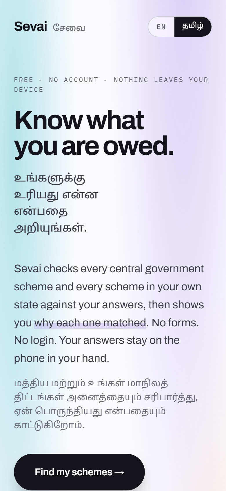
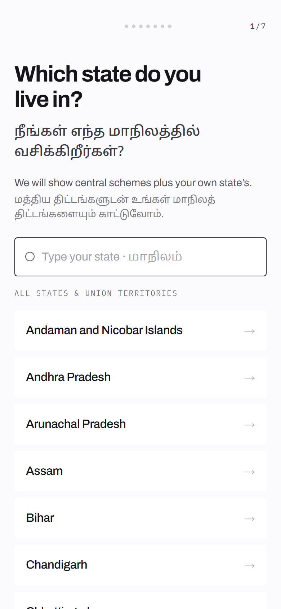
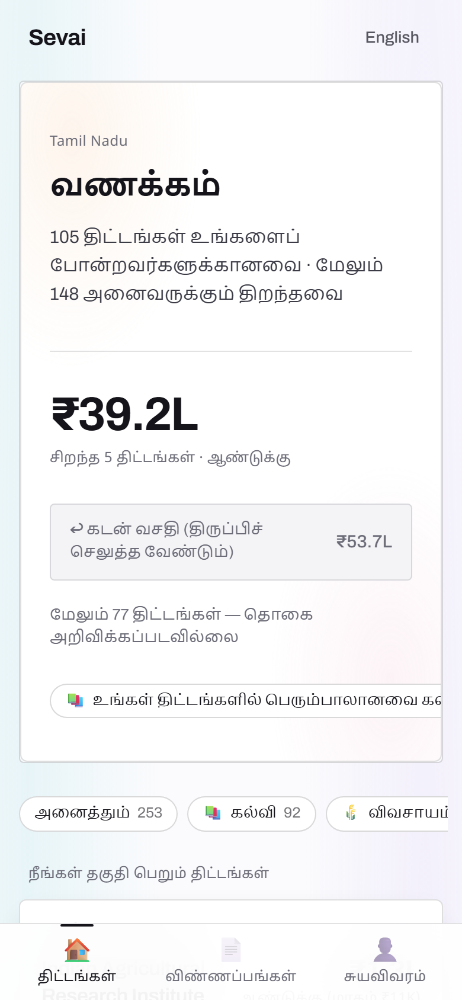
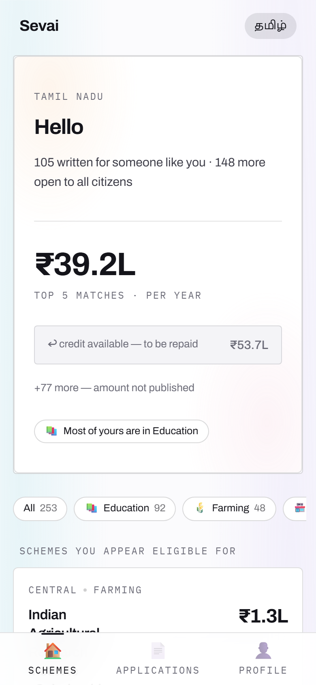
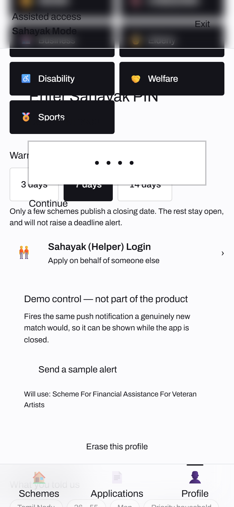
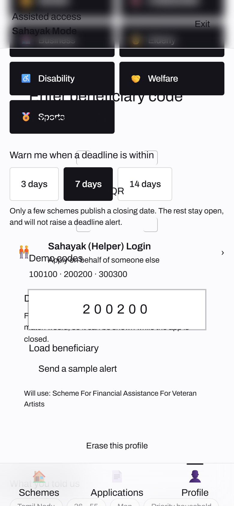
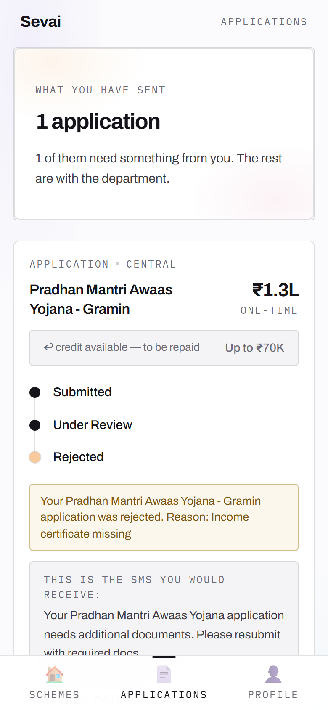

# Sevai-Scout

> Government welfare scheme discovery and application assistance for rural Tamil Nadu, reachable from a feature phone with no internet connection.

**2nd place — Nanohack 2K26, SIMATS.**



## The problem

State and central governments in India run several hundred welfare schemes at any given time — agricultural input subsidies, maternity benefits, education stipends, housing grants, crop insurance, pension top-ups. Each is written for a specific population. Most never reach that population.

The failure is not eligibility. It is discovery. A rural claimant typically learns a scheme exists through word of mouth, often after the application window has closed. They cannot look one up, because every official discovery channel — the state portal, the department website, the scheme PDF — assumes four things at once: a smartphone, a data connection, a supported language, and the literacy to read a government form. The people with the strongest claim on these schemes are precisely the people least likely to have all four.

The second failure is delegation. In practice, people who cannot complete an application hand their documents and their identity to whoever can operate the form — a relative with a smartphone, a village-level worker, an NGO volunteer, sometimes a paid intermediary. This is universal and entirely undocumented. The citizen has no record of what was done on their behalf and no way to revoke access once given. Most systems pretend this does not happen, which leaves it unprotected.

Sevai-Scout addresses both. It inverts discovery — rather than asking the citizen to search, it takes what it knows about them and returns what they are entitled to. And it makes delegation explicit, scoped and expiring, rather than leaving it to happen informally.

## Approach

**Meet the user on the channel they already own.** One eligibility engine sits behind four transports: SMS on a feature phone, WhatsApp, Telegram, and the web. A button phone with no data plan is treated as a first-class client rather than a degraded fallback, because for the target user it is the only client.

**Ask once, match against everything.** The citizen supplies their details and identity once into an on-device vault. The eligibility engine evaluates that profile against the full scheme catalogue and returns every scheme they qualify for, each with a direct application path. The citizen never reads a scheme document to determine whether it applies to them.

**Cross-scheme chaining.** Qualifying for one scheme is frequently predictive of qualifying for others — a landholding that triggers an input subsidy often also triggers crop insurance eligibility. After an application, the engine surfaces adjacent schemes that the newly confirmed attributes unlock.

**Regional languages with speech throughout.** The interface runs in regional languages and every screen can be read aloud through speech synthesis. Literacy is not a precondition for use. Voice input is captured for fields where typing is the barrier.

### Sahayak Mode — scoped delegated access

The design turns on this. A citizen who cannot complete an application alone generates a PIN and gives it to someone they trust. That PIN opens a session against their account lasting one hour, during which the helper can search schemes and submit applications on their behalf. The session then expires without any action from the citizen.

Three properties make this different from handing over a phone:

| Property | Why it matters |
|---|---|
| Time-bounded | Access ends automatically. The citizen does not have to remember to revoke it, or know how. |
| Scoped | The helper can search and apply. They cannot alter the identity vault or issue further PINs. |
| Audited | Every action taken under a delegated session is written to an audit log the citizen can review. |

Assisted access will happen regardless of what the software permits. Making it a first-class, constrained feature is safer than forcing it to route around the system.

**Identity stays on the device.** The Citizen Identity Vault is encrypted in browser local storage and never transmitted to a server. The eligibility engine evaluates against the profile locally; the backend sees scheme queries, not identity documents.

## Features

| Capability | How it works |
|---|---|
| Scheme matching | Rule-based eligibility engine evaluates a citizen profile against the scheme catalogue |
| Conversational onboarding | Chat-style Tamil flow collects the profile in roughly 90 seconds |
| Cross-scheme chaining | Confirmed attributes from one application surface adjacent eligible schemes |
| Sahayak Mode | PIN-issued, one-hour, audited delegated sessions |
| Multilingual interface | Regional-language interface copy with live switching; scheme titles remain as published |
| Text to speech | Any screen readable aloud via the Web Speech API |
| Identity vault | Encrypted on-device profile store, never transmitted |
| Application tracking | Status timeline per application, with a remediation path for rejections |

## Screenshots

### Conversational onboarding



The profile is collected as a chat in Tamil, one question at a time, with tappable
answers rather than typed input. Seven questions — age, occupation, district,
income, caste, gender — and the eligibility engine has everything it needs.

### Matched scheme feed



The result for a 41–60 farmer in Thanjavur with SC status and income under ₹1 lakh:
147 matched schemes worth an estimated ₹1.0 Cr per year. The citizen searched for
nothing — the engine evaluated the profile against the whole catalogue.

### Live language switching



The same screen after tapping the EN pill. Interface copy, headings and navigation
switch language in place, with no reload and no loss of state. Scheme titles
themselves come from the catalogue and are still English — see Limitations.

### Sahayak Mode — delegated access



A helper enters the citizen's PIN to open a scoped, time-bounded session. The demo
PIN is printed on screen because this is a hackathon build; production would issue
it cryptographically.

### Delegated session, scoped to one beneficiary



Inside a Sahayak session the helper loads exactly one beneficiary by code. Every
action taken during the session is written to an audit log the citizen can review,
and the session expires on its own.

### Application tracking



Submitted applications carry a status timeline. Where an application is rejected the
timeline shows the remediation path rather than a dead end.

## Architecture

```
Feature phone (SMS) ─┐
WhatsApp ────────────┤
Telegram ────────────┼──► channel adapters ──► eligibility engine ──► scheme catalogue
Web client ──────────┘        (designed)              │
                                                      ▼
                                         matched schemes + apply paths
                                                      │
      ┌───────────────────────────────────────────────┤
      ▼                                               ▼
Citizen Identity Vault                         Sahayak session
(encrypted, on-device)                    (PIN · 1 hour · audited)
```

The identity vault sits deliberately on the client side of the boundary. Scheme matching needs the profile; the server does not — so the profile never crosses. That constraint is the point: a compromised server exposes scheme queries, not the identity documents of every citizen who used the system.

## Tech stack

| Layer | Technology | Why |
|---|---|---|
| Client | React 18, Vite | Fast iteration under hackathon time pressure |
| Styling | TailwindCSS, Framer Motion | Motion carries meaning for low-literacy users that text cannot |
| Server | Node.js, Express | Thin proxy; holds no citizen state by design |
| Language | Claude API via backend proxy | Scheme-document interpretation and natural-language matching |
| Speech | Web Speech API | Synthesis and capture without a paid speech service |
| Storage | Browser local storage | Keeps the identity vault off the server |

## Getting started

### Prerequisites

- Node.js 18 or later
- An Anthropic API key is **optional**. Without one the app runs end to end;
  the AI routes return clearly-labelled mocks (`source: "mock"`) instead of
  reading a document. Scheme matching, the corpus and the Aadhaar QR scanner
  need no key and no network — they run entirely on the device.

### Installation

```bash
git clone https://github.com/varadharajanv0310/Sevai-TN.git
cd Sevai-TN
npm run install:all        # root, client and server dependencies
```

### Configuration

```bash
cp server/.env.example server/.env
```

| Variable | Required | Default | Purpose |
|---|---|---|---|
| `ANTHROPIC_API_KEY` | No | — | Vision OCR for documents, voice extraction. Unset → labelled mocks. |
| `CLAUDE_MODEL` | No | `claude-sonnet-5` | Model override |
| `PORT` | No | `5050` | API server port — **not 5000**, see below |
| `CLIENT_ORIGIN` | No | `http://localhost:5173` | CORS origin; needs to match for the DigiLocker session cookie |
| `DIGILOCKER_CLIENT_ID` | No | — | NeGD partner credential. Unset → the DigiLocker flow runs as a labelled demonstration. |
| `DIGILOCKER_CLIENT_SECRET` | No | — | As above. Server-only; never reaches the browser. |
| `ELEVENLABS_API_KEY` | No | — | Text to speech. Unset → the browser's own SpeechSynthesis. |

> **Why not port 5000.** Recent macOS runs the AirPlay Receiver on port 5000 and it
> answers every request with a 403. A dev proxy pointed at 5000 therefore looks like
> it is reaching an API when it is reaching Apple's service — which is exactly how the
> document scanner appeared to work while silently failing. The API defaults to 5050.

### Running

Both processes are needed: the client serves the app, the API serves `/api/*`.

```bash
npm run dev                # client and server concurrently
```

Client at `http://localhost:5173`, API at `http://localhost:5050`.

To check the API is actually up (and not Apple's service answering for it):

```bash
curl http://localhost:5050/api/health
```

## Project structure

```
Sevai-TN/
├── client/
│   ├── src/components/     # SahayakMode, onboarding, scheme feed, application timeline
│   ├── src/data/           # strings.js — all regional-language copy
│   └── src/utils/          # eligibilityEngine.js — scheme matching rules
└── server/                 # Express proxy for the language API
```

## What is built and what is designed

This is a hackathon MVP and the boundary should be explicit:

| Area | Status |
|---|---|
| Eligibility engine, scheme matching, cross-scheme chaining | Built |
| Sahayak Mode — PIN issue, scoped session, expiry, audit log | Built, with demo PINs rather than production authentication |
| Multilingual interface and text to speech | Built |
| Identity vault with on-device encryption | Built |
| Web client and conversational onboarding | Built |
| SMS, WhatsApp and Telegram adapters | Designed, not implemented |
| Document capture for applications | Mocked |
| Submission to government portals | Mocked — no official API integration exists |

Multi-channel reach is the core of the concept and the first thing a real deployment would need. It is specified here, not shipped.

## Limitations

- The scheme catalogue is a fixed subset, not a live feed from state departments. No official API exists to consume.
- Sahayak PINs are demonstration values. Production needs real cryptographic session issue and revocation.
- Eligibility rules are hand-encoded per scheme and do not survive a scheme's terms changing.
- Scheme titles and body text come from the catalogue in English; only the interface chrome is translated. A genuinely Tamil-first experience needs the catalogue translated too.
- No accessibility audit has been carried out with the intended user population.

## Roadmap

- SMS adapter against a real gateway, as the highest-value channel
- Scheme catalogue ingestion from department publications rather than a fixed subset
- Cryptographic session issue for Sahayak Mode with server-side revocation
- Field testing with village-level workers to validate the delegation model

## Team

Built at Nanohack 2K26, SIMATS, by **V Varadharajan** (lead), **Abishek VPT**, **L Prashanth** and **Mridah Shivakumar**.
