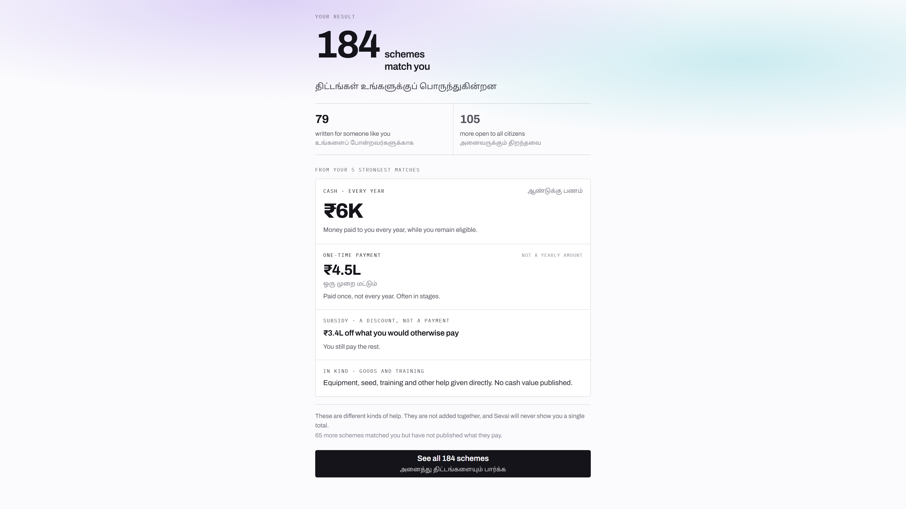
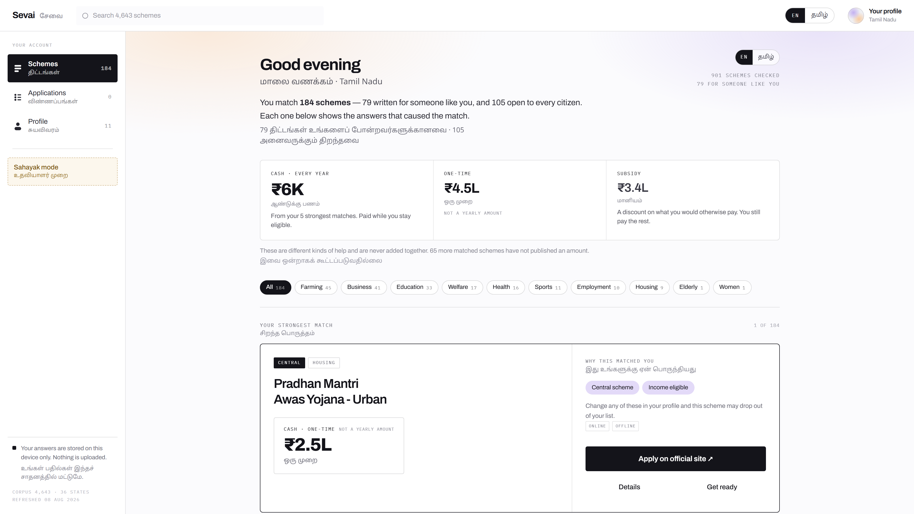
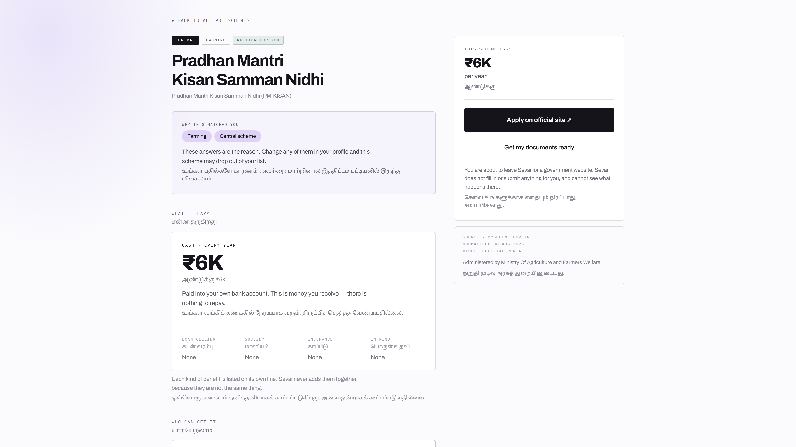
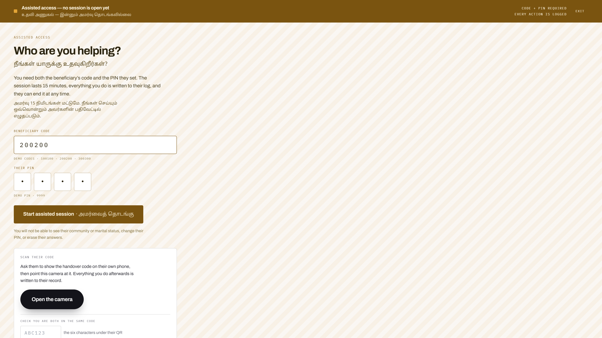

# Sevai

> Tells a citizen what government money they are already entitled to, and refuses
> to lie to them about it.


**CloudForge Hackathon** · Track 03 — Social Impact & Sustainability
**PS 14 — Financial Inclusion & Empowerment**

---

## Why this is a financial inclusion problem

Financial inclusion is usually read as bank accounts, credit and insurance. For a
household at or below the poverty line, that reading skips the largest financial
instrument they already hold.

They are entitled — today, by name, under money already appropriated — to direct
transfers, input subsidies, pensions, maternity benefits, scholarships and
premium-subsidised crop insurance. This is not credit they must qualify for. It is
income already budgeted for them. Most of it is never drawn.

The barrier is not creditworthiness, collateral or KYC. It is that nobody has told
them the money exists, in a form they can act on.

## The problem

This corpus alone holds **4,643 schemes** — 668 central, the rest across 36 states
and union territories. Each is written for a specific population. Most never reach
it.

The first failure is discovery. A rural claimant learns a scheme exists through word
of mouth, usually after the window has closed. Every official discovery channel — the
state portal, the department site, the scheme PDF — assumes four things at once: a
smartphone, a data connection, a supported language, and the literacy to read a
government form. The people with the strongest claim are the least likely to hold all
four.

The second failure is delegation. People who cannot complete an application hand
their documents and their identity to whoever can operate the form. This is universal
and entirely undocumented. The citizen has no record of what was done in their name
and no way to withdraw access once given. Most systems pretend it does not happen,
which is what leaves it unprotected.

## Approach

**Ask once, match against everything.** Seven questions — state, age, gender,
community, ration card, work — and the engine evaluates that profile against every
scheme the citizen could claim: all central schemes plus their own state's, around
900 for Tamil Nadu, **checked on the device itself**. The questionnaire grows only
where an answer opens a branch that matters: saying "farming" adds land ownership and
acreage. A profile that triggers nothing finishes in seven; the fullest path runs to
thirteen.

**Every match shows its reasoning.** Each result prints the citizen's own answers
that caused it, so the matching can be checked rather than trusted — and the screen
names which of those answers, if changed, would drop the scheme from the list.

**Reach is the architecture, not a feature.** One eligibility engine sits behind four
transports — SMS on a feature phone, WhatsApp, Telegram and the web — with the button
phone treated as a first-class client rather than a degraded fallback, because for
the target user it is the only client. This repository holds the web client and the
engine; the messaging adapters live in a separate repository and speak to the same
engine.

### Honest money — the decision the product turns on

On a financial product, a confidently wrong rupee figure is worse than no figure at
all. It is the number a household borrows against.

Money is separated into kinds and never summed. Each carries the sentence a citizen
needs in order to read it correctly:

| Kind | What the screen says |
|---|---|
| Cash, every year | "Money paid to you every year, while you remain eligible." |
| One-time payment | "Paid once, not every year. Often in stages." |
| Subsidy | "A discount, not a payment — you still pay the rest." |
| In kind | "Equipment, seed, training and other help given directly. No cash value published." |
| Credit available | "This is a borrowing limit, not income. Interest is charged, and it must be paid back." |

The screen then states the rule outright: *"These are different kinds of help. They
are not added together, and Sevai will never show you a single total."* Schemes that
publish no amount are counted and named as such — "65 more schemes matched you but
have not published what they pay" — rather than dropped or assigned a guess.

This is the financial-literacy component of PS 14, delivered where it is needed. A
citizen who has understood that an insurance ceiling is not income, and that a credit
limit must be repaid, has learned the distinction predatory lending depends on them
not knowing.

### The second language follows the citizen, not the browser

Every screen sets a second language beside its English. Which one is derived from the
citizen's **state** — the first thing onboarding asks, and required for scheme scoping
anyway — rather than from a browser locale, which on a shared or second-hand phone is
usually whatever the last owner set.

Thirteen languages are typeset: English, Hindi, Tamil, Telugu, Kannada, Malayalam,
Marathi, Gujarati, Bengali, Punjabi, Odia, Assamese and Urdu. The map is a default and
the citizen can change it. Union territories with no single dominant regional language,
and north-eastern states whose language of administration is English, are mapped to
English deliberately rather than forced into Hindi.

The reasoning is written into [`client/src/data/languages.js`](client/src/data/languages.js):
showing a citizen in Bihar a script they cannot read is worse than showing nothing,
because it occupies the space where help should be.

### Sahayak Mode — scoped delegated access

A citizen who cannot complete an application alone generates a PIN and gives it to
someone they trust. That PIN opens a session against their account for one hour.

| Property | Why it matters |
|---|---|
| Time-bounded | Access ends on its own. The citizen does not have to remember to revoke it, or know how. |
| Scoped | The helper can search and apply. They cannot alter the identity vault or issue further PINs. |
| Audited | Every action taken under a delegated session is written to a log the citizen can review. |

Assisted access will happen whatever the software permits. Making it a first-class,
constrained feature is safer than forcing it to route around the system.

**Identity stays on the device.** The vault is encrypted in browser local storage and
never transmitted. Matching runs locally; the backend sees scheme queries, never
identity documents. The profile can fill itself from a document through DigiLocker or
by scanning an Aadhaar, PAN or driving-licence QR code.

## Screenshots

### The result — money separated by kind



The screen the project exists for. 184 schemes matched this citizen; the money below
is split into cash, one-time, subsidy and in-kind, each carrying the sentence that
makes it readable, and the totals are never added together.

### The feed



Matches sorted by fit, with category counts, and the strongest match surfaced together
with the answers that caused it.

### A single scheme



PM-KISAN at ₹6,000 a year — a real published per-beneficiary figure — with *why this
matched you* printed back from the citizen's own answers.

### Sahayak Mode



A helper enters the citizen's PIN, then loads exactly one beneficiary by code. The PIN
and the codes are printed on screen because this is a hackathon build; production
would issue them cryptographically.

## Architecture

```
Feature phone (SMS) ─┐
WhatsApp ────────────┤   adapters — separate repository
Telegram ────────────┤
Web client ──────────┴──► eligibility engine ──► scheme corpus
                             (on device)         (sharded JSON)
                                  │
                   matched schemes + apply paths
                                  │
      ┌───────────────────────────┤
      ▼                           ▼
Citizen Identity Vault      Sahayak session
(encrypted, on-device)    (PIN · 1 hour · audited)
```

The vault sits deliberately on the client side of the boundary. Matching needs the
profile; the server does not — so the profile never crosses.

The corpus is **sharded by state**: the client fetches `central.json` plus the one
state file that applies, so adding states does not grow what a citizen downloads.

## Technology

| Layer | Technology |
|---|---|
| Client | React 18, Vite 5, React Router 6, TailwindCSS 3, Framer Motion 11, PWA service worker |
| Server | Node.js 18, Express 4 — stateless proxy, holds no citizen data |
| Language model | Claude `claude-sonnet-5` via `@anthropic-ai/sdk` — scheme summarisation, intent extraction, document field extraction |
| Speech | ElevenLabs REST, with the Web Speech API as fallback so it degrades rather than fails |
| Identity | Encrypted localStorage vault, DigiLocker, Aadhaar / PAN / driving-licence QR parsing |
| Corpus | 4,643 schemes from `myscheme.gov.in`, harvested with Python + Playwright |
| Eligibility | Faceted rule engine, entirely client-side |

## Getting started

```bash
git clone https://github.com/varadharajanv0310/cloud-forge-hackathon.git
cd cloud-forge-hackathon
npm run install:all
cp .env.example server/.env      # add your keys
npm run dev
```

Client at `http://localhost:5173`, server at `http://localhost:5000`.

| Variable | Required | Purpose |
|---|---|---|
| `ANTHROPIC_API_KEY` | Yes | Scheme summarisation, intent extraction, document reading |
| `ELEVENLABS_API_KEY` | No | Speech. Without it `/api/tts` returns `503` and the client falls back to browser synthesis |
| `CLAUDE_MODEL` | No | Overrides the default `claude-sonnet-5` |
| `PORT` | No | Server port, default `5000` |

**Demo reset.** The app resumes into the dashboard whenever a vault exists on the
device, which is right for a citizen and wrong for a walkthrough. Open **`/?demo`** to
clear it and start on the landing page; the URL rewrites itself back to `/`.

## What is built and what is designed

| Area | Status |
|---|---|
| Faceted eligibility engine, on-device matching, match provenance | Built |
| Honest money breakdown — kinds never summed, amounts never invented | Built |
| Cross-scheme chaining | Built |
| All-India corpus, sharded by state | Built |
| 13 languages, second language derived from state | Built |
| Sahayak Mode — PIN, scoped session, expiry, audit log | Built, with demo PINs rather than production authentication |
| DigiLocker and Aadhaar / PAN / DL QR document capture | Built |
| Identity vault with on-device encryption | Built |
| SMS, WhatsApp and Telegram adapters | Built in a separate repository against this engine |
| Submission to government portals | Not attempted — no official API exists. Every application links out to the department's own site |

## Limitations

- The corpus is a periodic snapshot, not a live feed. No official API exists to
  consume, so it goes stale between harvests.
- Sahayak PINs are demonstration values. Production needs cryptographic session issue
  and server-side revocation.
- Eligibility facets are derived from published scheme text and do not survive a
  scheme's terms changing.
- Scheme titles and body text come from the corpus in English. Only the interface is
  translated; a genuinely multilingual experience needs the corpus translated too.
- Published amounts are taken as written. Where a scheme publishes a departmental
  outlay rather than a per-beneficiary figure, that is what the card shows.
- No accessibility audit has been carried out with the intended user population.

## Impact & scalability

**Who it reaches.** The design target is a household that owns a feature phone, reads
little, speaks a language other than English, and is entitled to money it has never
heard of. Every architectural decision — on-device matching, a state-sharded corpus, a
state-derived second language, delegated sessions, SMS as a first-class transport —
follows from that user rather than from a smartphone owner with a data plan.

**Why it scales technically.** Matching runs on the device, so per-user server cost is
zero and the backend is a stateless proxy. The corpus is sharded by state, so a citizen
downloads central plus their own regardless of how large the national corpus grows.
Serving is a CDN problem, not a compute problem.

**Why it scales operationally.** Extending to a new state is a data shard and a
language mapping, not an engine change — all 36 states and union territories are
already carried. Sahayak Mode maps onto delivery networks that already exist: Common
Service Centre operators, village-level entrepreneurs, and self-help group
facilitators, all of whom already fill these forms informally.

## Repository layout

```
client/          React app — engine, vault, every screen
  public/data/   sharded corpus: central.json + 36 state files
  src/data/      languages.js — which language sits beside English, and why
  src/utils/     eligibilityEngine.js, documentQr.js, digilocker.js
server/          Express proxy — Claude, TTS, DigiLocker, Sahayak, document extraction
  scraper/       Python + Playwright harvester and normaliser
docs/film/       pipeline that builds the demo film from the running app
```

## Team

**V Varadharajan** · **Abishek VPT** · **L Prashanth** · **Mridah Shivakumar**
