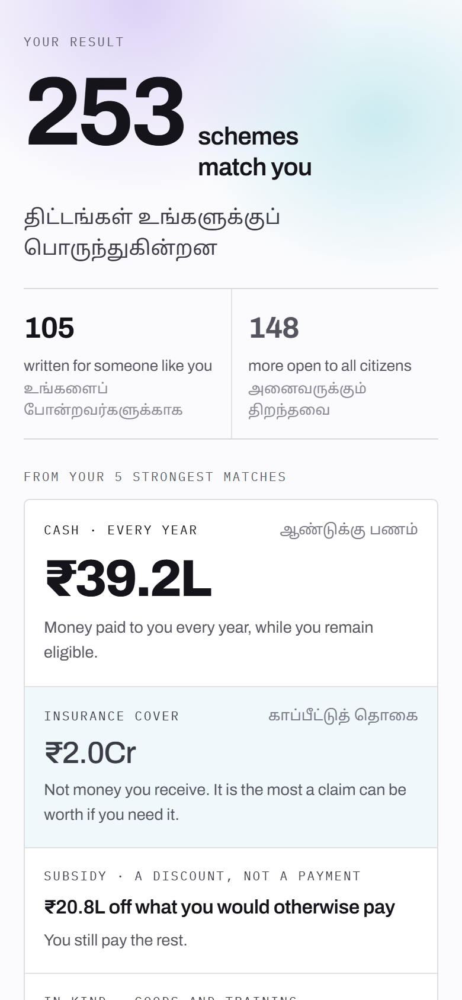

# Sevai

> Welfare entitlement is the largest financial instrument a poor household owns,
> and the hardest one to find. Sevai turns a citizen's profile into the list of
> schemes that will actually pay them — on a phone they already have, in a
> language they already speak.


**CloudForge Hackathon** · Track 03 — Social Impact & Sustainability
**PS 14 — Financial Inclusion & Empowerment**

---

## Why this is a financial inclusion problem

Financial inclusion is usually read as bank accounts, credit, and insurance. For a
household at or below the poverty line, that reading skips the largest financial
instrument they already hold.

They are entitled — today, by name, under money already appropriated — to direct
transfers, input subsidies, pensions, maternity benefits, scholarships and
premium-subsidised crop insurance. This is not credit they must qualify for. It is
income that has already been budgeted for them. And most of it is never drawn.

The barrier is not creditworthiness, collateral, or KYC. It is that nobody has told
them the money exists, in a form they can act on.

PS 14 asks for four things: access to financial information, responsible financial
services, financial literacy, and economic opportunity for underserved users.
Unclaimed entitlement sits on all four at once. It is the highest-return financial
information you can hand a rural household, because the money requires no repayment
and carries no interest — it only requires knowing about it before the window shuts.

## The problem

Central and state governments in India run several thousand welfare schemes at any
one time. This repository's corpus alone holds **4,707** — 668 central, 4,039 across
36 states and union territories. Each is written for a specific population. Most
never reach it.

The first failure is discovery. A rural claimant learns a scheme exists through word
of mouth, usually after the window has closed. They cannot look one up, because every
official discovery channel — the state portal, the department site, the scheme PDF —
assumes four things simultaneously: a smartphone, a data connection, a supported
language, and the literacy to read a government form. The people with the strongest
claim on these schemes are precisely the people least likely to hold all four.

The second failure is delegation. People who cannot complete an application hand
their documents and their identity to whoever can operate the form — a relative with
a smartphone, a village-level worker, an NGO volunteer, sometimes a paid
intermediary. This is universal and entirely undocumented. The citizen has no record
of what was done in their name and no way to withdraw access once given. Most systems
pretend it does not happen, which is what leaves it unprotected.

Sevai addresses both. It inverts discovery — instead of asking the citizen to search,
it takes what it knows about them and returns what they are owed. And it makes
delegation explicit, scoped and expiring rather than informal.

## Approach

**Meet the user on the channel they already own.** One eligibility engine sits behind
four transports: SMS on a feature phone, WhatsApp, Telegram, and the web. A button
phone with no data plan is treated as a first-class client rather than a degraded
fallback, because for the target user it is the only client. *(Web is shipped; the
three messaging adapters are specified, not built — see [What is built and what is
designed](#what-is-built-and-what-is-designed).)*

**Ask once, match against everything.** The citizen answers a short adaptive
questionnaire once — state, age, gender, community, ration card, occupation — into an
on-device vault. It opens at seven questions and grows only where an answer opens a
branch that matters: saying "farming" adds land ownership and acreage, saying
"expecting a child" adds maternity criteria. A profile that triggers nothing finishes
in seven; the fullest path runs to thirteen.

The engine then evaluates that profile against every scheme they could claim: central
plus their own state. For a Tamil Nadu citizen that is **901 schemes** (668 central +
233 state), checked on the device. The citizen never reads a scheme document to find
out whether it applies to them.

**Cross-scheme chaining.** Qualifying for one scheme is often predictive of
qualifying for others — a landholding that triggers an input subsidy frequently also
triggers crop insurance eligibility. After an application, the engine surfaces the
adjacent schemes the newly confirmed attributes unlock. Relationships are precomputed
into the corpus (average 3.2 per scheme) rather than rebuilt per query.

**Tamil first, with speech throughout.** The interface runs in Tamil and English with
live switching, and any screen can be read aloud. Literacy is not a precondition for
use. Voice input is captured for the fields where typing is the barrier.

### Honest money — the design decision that matters most here

On a financial product, a confidently wrong rupee figure is worse than no figure at
all. It is the number a household borrows against.

The first version of this engine summed one amount per matched scheme, substituted
₹50,000 whenever it could not parse the amount, and labelled the total "per year."
That figure was wrong in three separate ways: it mixed a ₹3 lakh *loan ceiling* with a
₹6,000 *annual transfer* with a one-time ₹50,000 *grant*, it invented a value for
every scheme it failed to parse, and it annualised things that were not annual.

The current engine returns a **breakdown that never mixes kinds and never invents a
figure.** Money is separated into five kinds, and each carries the sentence a citizen
needs in order to read it correctly:

| Kind | What the screen says |
|---|---|
| Cash, every year | "Money paid to you every year, while you remain eligible." |
| Insurance cover | "Not money you receive. It is the most a claim can be worth if you need it." |
| Subsidy | "A discount, not a payment — you still pay the rest." |
| In kind | "Equipment, seed, training and other help given directly. No cash value published." |
| Credit available | "This is a borrowing limit, not income. Interest is charged, and it must be paid back." |

The screen then states the rule outright: *"These are different kinds of help. They are
not added together, and Sevai will never show you a single total."* Schemes that have
not published what they pay are counted and named as such — "87 more schemes matched
you but have not published what they pay" — rather than being dropped or assigned a
guess.

This is the financial-literacy component of PS 14, delivered where it is actually
needed. A citizen who has understood that an insurance ceiling is not income, and that
a credit limit must be repaid, has learned the distinction that predatory lending
depends on them not knowing.

The same principle governs matching. v1 returned 137 of 233 schemes for a typical
profile — a phone book, not a feed — because income limits existed on only 37 schemes
and occupation on 99. The corpus now carries structured facets for gender, caste,
occupation, BPL status, student status, disability and residence, and institutional
schemes (which no individual can claim) are dropped from a citizen's feed entirely.
A match now means something.

### Sahayak Mode — scoped delegated access

The design turns on this. A citizen who cannot complete an application alone generates
a PIN and gives it to someone they trust. That PIN opens a session against their
account for one hour, during which the helper can search schemes and submit
applications for them. The session then expires with no action required from the
citizen.

| Property | Why it matters |
|---|---|
| Time-bounded | Access ends on its own. The citizen does not have to remember to revoke it, or know how. |
| Scoped | The helper can search and apply. They cannot alter the identity vault or issue further PINs. |
| Audited | Every action taken under a delegated session is written to a log the citizen can review. |

Assisted access will happen whatever the software permits. Making it a first-class,
constrained feature is safer than forcing it to route around the system.

**Identity stays on the device.** The Citizen Identity Vault is encrypted in browser
local storage and never transmitted. Matching runs locally against the profile; the
backend sees scheme queries, never identity documents. A compromised server exposes
what was searched for, not who searched.

## Features

| Capability | How it works |
|---|---|
| Scheme matching | Faceted eligibility engine evaluates a profile against central + home-state schemes on device |
| Honest money | Amounts broken out into five kinds, each explained, never summed, never invented |
| Adaptive onboarding | Opens at seven questions, branches to at most thirteen, tappable answers rather than typed input |
| Match provenance | The citizen's own answers are printed on each result, so the reasoning can be checked rather than trusted |
| Near-miss surfacing | Schemes the citizen narrowly fails are shown separately with the failing criterion named |
| Cross-scheme chaining | Confirmed attributes from one application surface adjacent eligible schemes |
| Sahayak Mode | PIN-issued, one-hour, audited delegated sessions |
| Bilingual interface | Tamil and English with live in-place switching, no reload, no loss of state |
| Text to speech | Any screen read aloud — ElevenLabs where a key is present, browser speech synthesis otherwise |
| Deadline visualisation | Time remaining on each scheme's window, surfaced on the card |
| Identity vault | Encrypted on-device profile store, never transmitted |
| Application tracking | Status timeline per application, with a remediation path for rejections |

## Screenshots

Captured from the running build against one profile — a smallholder farmer in Tamil
Nadu: SC, priority ration card, owns under an acre, no cattle.

### Landing


The claim the product has to earn, and the three constraints it accepts: free, no
account, nothing leaves the device.

### Adaptive onboarding


One question at a time, in large type, with tappable answers. It opens at seven and
branches only where an answer opens something that matters.

### The result — money, separated by kind



The screen the whole project exists for. 253 schemes matched; the money below is split
into cash, insurance cover, subsidy, in-kind and credit, each carrying the sentence
that makes it readable, and the totals are never added together. 77 further schemes
matched but publish no amount, and are counted as such rather than guessed at.

### Matched scheme feed


The citizen searched for nothing — the engine evaluated their profile against all 901
schemes they could claim and sorted what came back.

### Live language switching


The same screen in English. Interface copy, headings and navigation switch in place.
Scheme titles come from the corpus and remain English — see [Limitations](#limitations).

### Sahayak Mode and application tracking

Not captured. Both screens render against design tokens that are referenced throughout
the components but never defined in `tailwind.config.js` or `index.css` — `bg-canvas`,
`surface-plate`, `btn-primary`, `u-meta` and roughly fifteen others. The markup and
logic are correct; the styling silently resolves to nothing, which is most visible on
`SahayakMode`, whose full-screen overlay renders transparently over the page behind it.
Captures are held back until that is fixed rather than shipped misleading. See
[Known defects](#known-defects).

## Architecture

```
Feature phone (SMS) ─┐
WhatsApp ────────────┤
Telegram ────────────┼──► channel adapters ──► eligibility engine ──► scheme corpus
Web client ──────────┘        (designed)         (on device)        (sharded JSON)
                                                      │
                                       matched schemes + apply paths
                                                      │
      ┌───────────────────────────────────────────────┤
      ▼                                               ▼
Citizen Identity Vault                         Sahayak session
(encrypted, on-device)                    (PIN · 1 hour · audited)
```

The identity vault sits deliberately on the client side of the boundary. Matching needs
the profile; the server does not — so the profile never crosses.

The corpus is **sharded by state**: the client fetches `central.json` plus the one state
file that applies. Adding the remaining states does not grow the payload a citizen
downloads, which is what keeps this viable on a 2G connection.

## Technology stack

| Layer | Technology | Why |
|---|---|---|
| Client | React 18, Vite 5, React Router 6 | Fast iteration under hackathon time pressure |
| Styling | TailwindCSS 3, Framer Motion 11 | Motion carries meaning for low-literacy users that text cannot |
| Server | Node.js 18+, Express 4 | Thin proxy; holds no citizen state by design |
| Language model | Claude (`@anthropic-ai/sdk`) via backend proxy | Scheme summarisation, intent extraction, document reading |
| Speech | ElevenLabs REST, with Web Speech API fallback | Tamil pronunciation quality; degrades rather than fails without a key |
| Corpus | Sharded JSON, harvested from `myscheme.gov.in` | 4,707 schemes, 36 states & UTs, harvested 7 Aug 2026 |
| Harvester | Python + Playwright | Scheme fetch and normalisation into structured facets |
| Storage | Browser local storage, encrypted | Keeps the identity vault off the server |

## Getting started

### Prerequisites

- Node.js 18 or later
- An Anthropic API key (scheme summarisation, document reading)
- An ElevenLabs API key — optional; without it, speech falls back to the browser

### Installation

```bash
git clone https://github.com/varadharajanv0310/cloud-forge-hackathon.git
cd cloud-forge-hackathon
npm run install:all        # root, client and server dependencies
```

### Configuration

```bash
cp .env.example server/.env
```

| Variable | Required | Default | Purpose |
|---|---|---|---|
| `ANTHROPIC_API_KEY` | Yes | — | Scheme summarisation, intent extraction, document reading |
| `ELEVENLABS_API_KEY` | No | — | Tamil speech. Without it `/api/tts` returns `503 audio_unavailable` and the client falls back to browser speech synthesis |
| `ELEVENLABS_VOICE_ID` | No | `XrExE9yKIg1WjnnlVkGX` | Voice used for synthesis |
| `PORT` | No | `5000` | Server port |

### Running

```bash
npm run dev                # client and server concurrently
```

Client at `http://localhost:5173`, server at `http://localhost:5000`.

## Project structure

```
cloud-forge-hackathon/
├── client/
│   ├── public/data/        # sharded scheme corpus — central.json + 36 state files
│   ├── src/components/     # SahayakMode, onboarding, scheme feed, application timeline
│   ├── src/data/           # strings.js — all Tamil and English copy
│   ├── src/hooks/          # useEligibility, useVault, useTTS, useLanguage
│   └── src/utils/          # eligibilityEngine.js — faceted matching and money breakdown
└── server/
    ├── routes/             # extractDocument, intentExtraction, schemeSummarizer, tts
    └── scraper/            # Playwright harvester + normaliser for the corpus
```

## What is built and what is designed

This is a hackathon MVP and the boundary should be explicit.

| Area | Status |
|---|---|
| Faceted eligibility engine, scheme matching, near-miss surfacing | Built |
| Honest money breakdown — five kinds, each explained, never summed, never invented | Built |
| Adaptive onboarding across all 36 states and UTs | Built |
| Cross-scheme chaining over precomputed relationships | Built |
| All-India corpus, sharded by state, harvested from a live source | Built |
| Sahayak Mode — PIN issue, scoped session, expiry, audit log | Built, with demo PINs rather than production authentication |
| Bilingual interface and text to speech | Built |
| Identity vault with on-device encryption | Built |
| Web client and conversational onboarding | Built |
| SMS, WhatsApp and Telegram adapters | Designed, not implemented |
| Document capture for applications | Mocked |
| Submission to government portals | Mocked — no official API integration exists |

Multi-channel reach is central to the concept and the first thing a real deployment
would need. It is specified here, not shipped.

## Known defects

Found while recapturing screenshots against the running build. Both are open.

**The design tokens the components are written against are not defined.** Roughly
nineteen classes — `bg-canvas`, `bg-surface`, `bg-surface-sub`, `text-muted`,
`text-lead`, `text-q`, `text-scheme`, `u-meta`, `u-display`, `u-scheme-name`,
`btn-primary`, `btn-secondary`, `btn-ghost`, `surface-tray`, `surface-plate`,
`border-hairline`, `ring-hairline`, `amber-banner`, `rounded-well` — are used across
almost every component but exist in neither `tailwind.config.js` nor `index.css`.
Tailwind emits nothing for an unknown utility and reports no error, so the pages that
lean hardest on them degrade silently. `Landing` and the result screen are unaffected
and render as designed; `SahayakMode`, `Applications`, `Profile` and `SchemeDetail`
are visibly degraded. The sharpest symptom is that `bg-canvas` — the background on
three full-screen overlays, including Sahayak Mode — computes to `rgba(0,0,0,0)`, so
those overlays are transparent and the page behind shows through. `BottomNav` is
transparent for the same reason, which is why feed content runs under the navigation
bar. The colour exists in the config under a different name (`page`), so the smallest
correct fix is to define the missing tokens rather than to rename usages.

**The seeded demo application points at a scheme that no longer exists.** The
Applications screen ships one pre-seeded record referencing `pmay-gramin`, an ID from
the v1 Tamil Nadu corpus. The v2 all-India corpus is keyed differently, so the record
resolves to "Scheme details unavailable" and the status timeline renders against a
missing scheme.

## Limitations

- The corpus is a snapshot harvested on 7 Aug 2026, not a live feed. No official API
  exists to consume, so it goes stale between harvests.
- Published amounts are taken as written. Where a scheme publishes a departmental
  outlay rather than a per-beneficiary figure, the cash line inherits that number, and
  a maximally-qualifying profile can produce an implausibly large annual total. The
  breakdown is honest about *kind*; it is only as accurate about *magnitude* as the
  source text.
- Sahayak PINs are demonstration values. Production needs real cryptographic session
  issue and server-side revocation.
- Eligibility facets are derived from published scheme text and do not survive a
  scheme's terms changing.
- Scheme titles and body text remain English. Only the interface chrome is translated.
  A genuinely Tamil-first experience needs the corpus translated too.
- Speech quality depends on an ElevenLabs key. The browser fallback reads Tamil poorly
  on desktop, acceptably on Android and iOS Chrome.
- No accessibility audit has been carried out with the intended user population.

## Impact & scalability

**Who it reaches.** The design target is a household that owns a feature phone, reads
little, speaks Tamil, and is entitled to money it has never heard of. Every
architectural decision — on-device matching, state-sharded corpus, speech on every
screen, delegated sessions — follows from that user rather than from a smartphone
owner with a data plan.

**Why it scales technically.** Matching runs on the device, so per-user server cost is
zero and the backend is a stateless proxy. The corpus is sharded by state, so a citizen
downloads central + their own state regardless of how large the national corpus grows.
Serving is a CDN problem, not a compute problem.

**Why it scales operationally.** Extending to a new state is a districts list and a
strings file, not an engine change — the corpus already carries all 36 states and UTs.
And Sahayak Mode maps directly onto delivery networks that already exist: Common
Service Centre operators, village-level entrepreneurs, and self-help group
facilitators, all of whom already fill these forms informally.

**What would have to be true for real deployment.** A live ingestion agreement with
department publications, an SMS gateway, cryptographic session issue, and field
validation of the delegation model with village-level workers. These are named in the
roadmap rather than claimed as done.

## Roadmap

- SMS adapter against a real gateway — the highest-value channel and the largest gap
- Corpus ingestion from department publications rather than a periodic scrape
- Cryptographic session issue for Sahayak Mode with server-side revocation
- Per-beneficiary amount extraction, so a departmental outlay is never read as a
  personal entitlement
- Corpus translation, so scheme text is Tamil rather than only the chrome
- Field testing with village-level workers to validate the delegation model

## Provenance

Sevai began as **Sevai-Scout**, an open-source project by the same team
([varadharajanv0310/Sevai-TN](https://github.com/varadharajanv0310/Sevai-TN)), and this
repository carries that full commit history. The work is disclosed rather than
reintroduced as new: the prior build established the eligibility engine, the Tamil and
speech layer, the identity vault and Sahayak Mode; this submission reframes the system
for financial inclusion and carries the v2 corpus and matcher.

## Team

**V Varadharajan** (lead), **Abishek VPT**, **L Prashanth**, **Mridah Shivakumar**.
